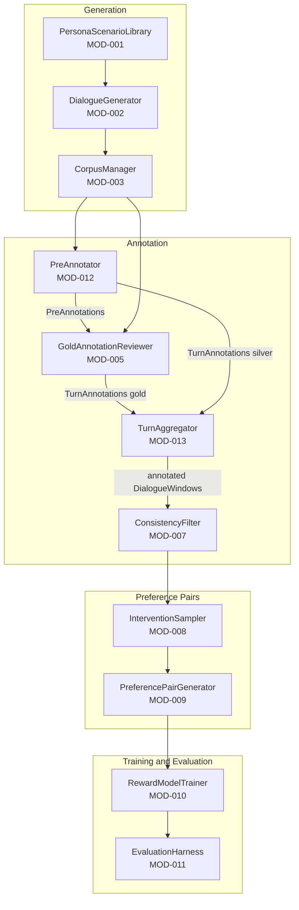

# Technical Design Document: FPO Mediation Extension — Computational Pipeline

## 1. System Architecture

### Overview

The pipeline transforms a library of conflict personas, scenarios, and pragmatic stylistics profiles into a trained reward model capable of scoring mediation interventions. It operates in four sequential stages: dialogue generation, annotation, preference pair construction, and reward model training and evaluation.



### Key Design Decisions

| Decision | Rationale |
|---|---|
| Two-agent generation (Claude Sonnet × 2) | Information asymmetry between agents produces genuine conflict dynamics; single-LLM generation yields cooperative, on-rails dialogue |
| Haiku as moderator | Termination is a simple classification call; using a cheaper model preserves budget for generation |
| Claude Sonnet-4-6 as silver annotator (direct API, hand-curated few-shot examples) | IAA validation showed Sonnet (κ=0.671) matches the gold annotation ceiling; DSPy/GPT-4o (κ=0.391) was structurally insufficient due to repair/deficit confusion in the taxonomy. Direct API calls with tool-forced structured output and hand-curated demonstrations replace the BootstrapFewShot pipeline. |
| Turn-level annotation with trailing-window context | Finer-grained reward signal (position and density of deficit turns); trailing window keeps annotation-time information consistent with the downstream model's causal inference-time information set |
| PreAnnotator as gold annotation support tool | Claude reads the full AARC taxonomy and suggests labels + rationale + confidence per turn before researcher review; supports the human annotator without being the authoritative source of gold labels |
| JSONL for corpus storage | Append-friendly, inspectable, compatible with HuggingFace datasets; no database overhead needed at this scale |
| Bradley-Terry for preference pairs | Established RLHF methodology; compatible with Unsloth GRPO reward function interface downstream |
| Pragmatic stylistics profiles as independent generation input | Assigning each agent a stylistics profile (silence/pause norms, filler use, turn-taking, redundancy) independently of persona creates a second friction axis — pragmatic clash — on top of content-level conflict, enriching the deficit signal available for annotation. Independence from personas prevents conflation with face salience and communicative register already encoded there. |

---

## 2. Module Descriptions

### MOD-001: PersonaScenarioLibrary
**Implements:** DEL-005, DEL-006
**Validated by:** VC-04

**Purpose:** Loads persona profiles, scenario briefs, and stylistics profiles from JSON files and provides sampling utilities for pairing them into dialogue generation tasks.

**Public Interface:**
```python
def load_personas(path: str) -> list[Persona]
def load_scenarios(path: str) -> list[Scenario]
def load_stylistics_profiles(path: str) -> list[StylisticsProfile]
def sample_pair(personas: list[Persona], scenarios: list[Scenario], seed: int | None) -> tuple[Persona, Persona, Scenario]
def sample_stylistics(profiles: list[StylisticsProfile], seed: int | None) -> tuple[StylisticsProfile, StylisticsProfile]
def get_all_pairs(personas: list[Persona], scenarios: list[Scenario]) -> list[tuple[Persona, Persona, Scenario]]
```

**Notes:** `sample_stylistics` samples independently for each agent slot — the same profile may be assigned to both. Profiles are assigned independently of personas: any persona can receive any stylistic profile.

**Dependencies:**
- Internal: DS-001 (Persona), DS-002 (Scenario), DS-012 (StylisticsProfile)
- External: `json`, `random`

---

### MOD-002: DialogueGenerator
**Implements:** DEL-005, DEL-006
**Validated by:** VC-04

**Purpose:** Generates multi-turn conflict dialogues using a two-agent async architecture. Each agent sees only its own persona and the shared scenario brief. A moderator call after each turn determines whether the dialogue has reached a natural endpoint.

**Public Interface:**
```python
async def generate_dialogue(
    persona_a: Persona,
    persona_b: Persona,
    scenario: Scenario,
    min_turns: int = 8,
    max_turns: int = 20,
    client: AsyncAnthropic | None = None,
    stylistics_a: StylisticsProfile | None = None,
    stylistics_b: StylisticsProfile | None = None,
) -> Transcript

async def generate_turn(
    persona: Persona,
    scenario: Scenario,
    history: list[DialogueTurn],
    client: AsyncAnthropic,
    speaker_key: str = "party_a",
    director_note: str = "",
    stylistics_profile: StylisticsProfile | None = None,
) -> DialogueTurn

async def check_termination(
    history: list[DialogueTurn],
    persona_a: Persona,
    persona_b: Persona,
    client: AsyncAnthropic,
) -> tuple[bool, str, str]  # (should_terminate, verdict, director_note)

async def generate_batch(
    pairs: list[tuple[Persona, Persona, Scenario]],
    concurrency: int = 5,
    client: AsyncAnthropic | None = None,
    stylistics_pairs: list[tuple[StylisticsProfile | None, StylisticsProfile | None]] | None = None,
) -> list[Transcript]
```

**Dependencies:**
- Internal: MOD-001, DS-001, DS-002, DS-003, DS-004, DS-012
- External: `anthropic` (AsyncAnthropic), `asyncio`

**Notes:** Each agent maintains its own message history. The shared transcript (turn text only, not reasoning) is appended after each turn for both agents to read. CoT reasoning is retrieved from the native extended thinking API response block and stored in `DialogueTurn.reasoning`; it is never passed to the opposing agent or included in message history.

**Generation hyperparameters:**

| Parameter | Value | Applies to | Rationale |
|---|---|---|---|
| `model` (agent) | `claude-sonnet-4-6` | Agent turns | Most capable available model; needed for dispositional fidelity |
| `model` (moderator) | `claude-haiku-4-5-20251001` | Termination check | Classification task; cheaper model sufficient |
| `temperature` (agent) | `1.0` | Agent turns | Required by API when extended thinking is enabled |
| `temperature` (moderator) | `0.1` | Termination check | Near-deterministic; prevents malformed labels |
| `thinking.budget_tokens` | `1024` | Agent turns | Reasoning budget per turn; covers dispositional deliberation without excess cost |
| `max_tokens` (agent) | `2048` | Agent turns | Must exceed `budget_tokens`; headroom for thinking + 3–5 sentence output |
| `max_tokens` (moderator) | `64` | Termination check | Single-word label with short reason |

---

### MOD-003: CorpusManager
**Implements:** DEL-005, DEL-006
**Validated by:** VC-04

**Purpose:** Persists transcripts to JSONL, retrieves by ID or filter, and tracks gold vs. silver status.

**Public Interface:**
```python
def save_transcript(transcript: Transcript, path: str) -> None
def load_transcript(transcript_id: str, path: str) -> Transcript
def load_all(path: str, gold_only: bool = False) -> list[Transcript]
def mark_gold(transcript_id: str, path: str) -> None
def get_stats(path: str) -> dict  # counts, gold count, avg turns
```

**Dependencies:**
- Internal: DS-004 (Transcript)
- External: `json`, `pathlib`

---

### MOD-004: WindowExtractor *(Archived)*
**Implements:** DEL-006
**Validated by:** VC-03, VC-05

> **Archived.** Trailing-window context formatting is currently handled inline by MOD-012 (`format_context`). The standalone module and its tests have been moved to `archive/`. When preference pair construction begins (MOD-007–009), `DialogueWindow` objects will be required by MOD-013; this module will need to be re-introduced at that stage.

**Purpose:** Extracts all 7-turn sliding windows from a transcript at 1-turn increments. Returns a list of DialogueWindow objects ready for annotation.

**Public Interface:**
```python
def extract_windows(transcript: Transcript, window_size: int = 7) -> list[DialogueWindow]
def extract_all(transcripts: list[Transcript], window_size: int = 7) -> list[DialogueWindow]
```

**Dependencies:**
- Internal: DS-004 (Transcript), DS-005 (DialogueWindow)

---

### MOD-005: GoldAnnotationReviewer
**Implements:** DEL-005
**Validated by:** VC-02, VC-04

**Purpose:** CLI tool for researcher turn-level annotation of dialogue transcripts. For each unannotated turn, displays the trailing seven-turn context and — where available — the PreAnnotator's suggested labels, rationale, and confidence. The researcher accepts or overrides each suggestion; confirmed labels become the gold TurnAnnotations.

**Public Interface:**
```python
def run_review_session(
    transcripts: list[Transcript],
    output_path: str,
    pre_annotations_path: str,
    *,
    persona_map: dict[str, str] | None = None,
    scenario_map: dict[str, str] | None = None,
    scenario_filter: set[str] | None = None,
) -> None
def display_turn_in_context(
    transcript: Transcript,
    turn_index: int,
    *,
    name_a: str,
    name_b: str,
    scenario_title: str | None,
) -> None
def save_turn_annotation(annotation: TurnAnnotation, path: str) -> None
def load_turn_annotations(path: str) -> list[TurnAnnotation]
# Kept for backward compatibility:
def save_annotation(annotation: GoldAnnotation, path: str) -> None
def load_annotations(path: str) -> list[GoldAnnotation]
```

**Dependencies:**
- Internal: DS-004 (Transcript), DS-010 (TurnAnnotation), DS-011 (PreAnnotation), MOD-012 (PreAnnotator)
- External: standard library only (no framework)

---

### MOD-006: DSPyAnnotator *(Archived — superseded by MOD-012)*
**Implements:** DEL-006
**Validated by:** VC-03, VC-05, VC-06

> **Archived.** IAA validation (mean κ=0.391 across four components) showed the DSPy/GPT-4o approach was structurally insufficient: the model consistently conflated repair moves with deficit absence, particularly for Agency and Clarity. Replaced by MOD-012 (PreAnnotator) using Claude Sonnet-4-6 directly (κ=0.671, matching the gold annotation ceiling). Module and tests moved to `archive/`.

**Purpose:** DSPy-based silver annotation module using GPT-4o (a different model family from the Claude generator, preventing a closed preference loop). Defines a turn-level annotation signature, optimizes the prompt using BootstrapFewShot against gold TurnAnnotations, and annotates turns at scale. Each turn is presented with its trailing seven-turn context, consistent with the causal window used during gold annotation.

**Public Interface:**
```python
def build_annotator(gold_annotations: list[TurnAnnotation]) -> dspy.Module
def annotate_turn(
    transcript: Transcript,
    turn_index: int,
    annotator: dspy.Module,
) -> TurnAnnotation
def annotate_batch(
    transcripts: list[Transcript],
    annotator: dspy.Module,
) -> list[TurnAnnotation]
def save_optimized_annotator(annotator: dspy.Module, path: str) -> None
def load_optimized_annotator(path: str) -> dspy.Module
```

**DSPy Signature:**
```python
class AARCAnnotation(dspy.Signature):
    context_text: str = dspy.InputField()   # trailing 7-turn window, focal turn marked ►
    acknowledgement_deficit: bool = dspy.OutputField()
    agency_deficit: bool = dspy.OutputField()
    reciprocity_deficit: bool = dspy.OutputField()
    clarity_deficit: bool = dspy.OutputField()
    rationale: str = dspy.OutputField()
```

**Dependencies:**
- Internal: DS-004 (Transcript), DS-010 (TurnAnnotation)
- External: `dspy`, `openai`

---

### MOD-007: ConsistencyFilter
**Implements:** DEL-006
**Validated by:** VC-06

**Purpose:** Compares silver TurnAnnotations against gold TurnAnnotations on spot-check turns. Removes silver annotations that diverge beyond a configurable threshold and reports agreement statistics (Krippendorff's alpha across the four binary components).

**Public Interface:**
```python
def compute_agreement(
    silver: list[TurnAnnotation],
    gold: list[TurnAnnotation],
) -> float  # Krippendorff's alpha

def filter_inconsistent(
    silver: list[TurnAnnotation],
    gold: list[TurnAnnotation],
    threshold: float = 0.7,
) -> list[TurnAnnotation]

def report(silver: list[TurnAnnotation], gold: list[TurnAnnotation]) -> dict
```

**Dependencies:**
- Internal: DS-010 (TurnAnnotation)
- External: `krippendorff`

---

### MOD-008: InterventionSampler
**Implements:** DEL-006
**Validated by:** VC-03

**Purpose:** For each high-friction window (at least one deficit label present), generates N candidate interventions drawn from the component-appropriate intervention types defined in the taxonomy.

**Public Interface:**
```python
async def sample_interventions(
    window: DialogueWindow,
    n: int = 6,
    client: AsyncOpenAI
) -> InterventionGroup

async def score_intervention(
    intervention: CandidateIntervention,
    window: DialogueWindow
) -> CandidateIntervention  # with component_scores and aggregate_score filled

async def sample_batch(
    windows: list[DialogueWindow],
    n: int = 6,
    concurrency: int = 10
) -> list[InterventionGroup]
```

**Dependencies:**
- Internal: DS-005, DS-006, DS-007
- External: `openai` (AsyncOpenAI), `asyncio`

---

### MOD-009: PreferencePairGenerator
**Implements:** DEL-006
**Validated by:** VC-03, VC-06

**Purpose:** Derives pairwise preference pairs from ranked intervention groups by sampling contrastive pairs across the ranked list. Outputs pairs in Bradley-Terry format.

**Public Interface:**
```python
def rank_group(group: InterventionGroup) -> InterventionGroup
def sample_pairs(group: InterventionGroup, strategy: str = "contrastive") -> list[PreferencePair]
def generate_all_pairs(groups: list[InterventionGroup]) -> list[PreferencePair]
def save_pairs(pairs: list[PreferencePair], path: str) -> None
def load_pairs(path: str) -> list[PreferencePair]
def get_stats(pairs: list[PreferencePair]) -> dict  # total, per-component breakdown
```

**Dependencies:**
- Internal: DS-006, DS-007, DS-008
- External: `json`

---

### MOD-010: RewardModelTrainer
**Implements:** DEL-007
**Validated by:** VC-06

**Purpose:** Fine-tunes a base LLM (LLaMA 8B) on preference pairs using the Bradley-Terry objective. Replaces the LM head with a scalar head and trains with `-log(sigmoid(r_chosen - r_rejected))` loss.

**Public Interface:**
```python
def build_reward_model(base_model_id: str) -> RewardModel
def prepare_dataset(pairs: list[PreferencePair], tokenizer) -> Dataset
def train(
    model: RewardModel,
    train_dataset: Dataset,
    eval_dataset: Dataset,
    output_path: str,
    learning_rate: float = 1e-5,
    epochs: int = 3
) -> RewardModel
def save(model: RewardModel, path: str) -> None
def load(path: str) -> RewardModel
```

**Dependencies:**
- Internal: DS-008
- External: `transformers`, `torch`, `datasets`

---

### MOD-011: EvaluationHarness
**Implements:** DEL-007, DEL-008
**Validated by:** VC-01, VC-05, VC-06

**Purpose:** Evaluates reward model accuracy on held-out preference pairs and runs the ablation study comparing AARC-enriched vs. friction-only reward signal.

**Public Interface:**
```python
def evaluate_rm_accuracy(
    model: RewardModel,
    held_out_pairs: list[PreferencePair]
) -> float  # agreement rate

def run_ablation(
    aarc_model: RewardModel,
    friction_only_model: RewardModel,
    held_out_pairs: list[PreferencePair]
) -> dict  # accuracy comparison per condition

def compute_label_correlation(
    corpus: list[DialogueWindow]
) -> dict  # AARC labels vs. FPO signal correlations

def generate_report(results: dict, output_path: str) -> None
```

**Dependencies:**
- Internal: DS-005, DS-008, MOD-010
- External: `torch`, `scipy`, `pandas`

---

### MOD-012: SilverAnnotator
**Implements:** (support tool for DEL-005; not a deliverable module)
**Files:** `claude_annotator.py` (Claude/Anthropic), `gpt_annotator.py` (OpenAI-compatible)

**Purpose:** First-pass annotation module with two provider implementations. `claude_annotator.py` also contains the gold annotation support tool (PreAnnotator): for each unannotated turn, builds the trailing seven-turn context window and calls Claude with the full AARC taxonomy as cached system context, returning a suggested label, one-sentence rationale, and self-reported confidence. `gpt_annotator.py` is the OpenAI-compatible silver annotator only (no preannotate functions), sharing prompt constants and I/O utilities with `claude_annotator.py`. Both providers expose an identical `silverannotate_batch` interface. Provider selection is handled by `scripts/silver_annotate.py` via `--provider claude|gpt`.

**Public Interface (claude_annotator.py):**
```python
def make_turn_id(transcript_id: str, turn_index: int) -> str
def format_context(transcript: Transcript, turn_index: int) -> str
async def preannotate_turn(transcript, turn_index, client: AsyncAnthropic, taxonomy_text, *, model) -> PreAnnotation
async def preannotate_batch(transcripts, taxonomy_path, output_path, batch_size, client: AsyncAnthropic, *, model) -> int
async def silverannotate_turn(transcript, turn_index, client: AsyncAnthropic, taxonomy_text, *, model) -> TurnAnnotation
async def silverannotate_batch(transcripts, taxonomy_path, output_path, batch_size, client: AsyncAnthropic, *, skip_ids, model) -> int
def load_pre_annotations(path: str) -> list[PreAnnotation]
def save_pre_annotation(annotation: PreAnnotation, path: str) -> None
def load_silver_annotations(path: str) -> list[TurnAnnotation]
def save_silver_annotation(annotation: TurnAnnotation, path: str) -> None
```

**Public Interface (gpt_annotator.py — silver only):**
```python
async def silverannotate_turn(transcript, turn_index, client: AsyncOpenAI, taxonomy_text, *, model) -> TurnAnnotation
async def silverannotate_batch(transcripts, taxonomy_path, output_path, batch_size, client: AsyncOpenAI, *, skip_ids, model) -> int
# I/O utilities re-exported from claude_annotator:
load_silver_annotations, save_silver_annotation
```

**Dependencies:**
- Internal: DS-004 (Transcript), DS-010 (TurnAnnotation), DS-011 (PreAnnotation)
- External: `anthropic` (AsyncAnthropic, tool use, prompt caching), `openai` (AsyncOpenAI, function calling)

---

### MOD-013: TurnAggregator
**Implements:** DEL-006

**Purpose:** Derives window-level AARC deficit labels from turn-level annotations. For each seven-turn sliding window, a component is labeled deficit-present if at least one turn within the window carries a positive TurnAnnotation label for that component. The count of positive turns per component constitutes the window severity signal. Takes unannotated DialogueWindow objects from MOD-004 and TurnAnnotations from MOD-005 or MOD-006, and returns annotated DialogueWindow objects ready for MOD-007.

**Public Interface:**
```python
def aggregate_window(
    window: DialogueWindow,
    turn_annotations: list[TurnAnnotation],
) -> DialogueWindow  # with deficit labels and is_high_friction filled

def aggregate_all(
    windows: list[DialogueWindow],
    turn_annotations: list[TurnAnnotation],
) -> list[DialogueWindow]

def severity_counts(
    window: DialogueWindow,
    turn_annotations: list[TurnAnnotation],
) -> dict[str, int]  # component -> count of deficit-positive turns within window
```

**Dependencies:**
- Internal: DS-005 (DialogueWindow), DS-010 (TurnAnnotation)

---

## 3. Data Flow

```mermaid
flowchart LR
    P[personas.json\nscenarios.json\nstylistics_profiles.json] --> LIB[PersonaScenarioLibrary]
    LIB -->|Persona × 2 + Scenario\n+ StylisticsProfile × 2| GEN[DialogueGenerator]
    GEN -->|Transcript| CORP[CorpusManager]
    CORP -->|Transcripts| PRE[PreAnnotator]
    PRE -->|pre_annotations.jsonl| GOLD[GoldAnnotationReviewer]
    CORP -->|Transcripts| GOLD
    GOLD -->|gold_annotations.jsonl| AGG[TurnAggregator]
    PRE -->|silver_annotations.jsonl| AGG
    AGG -->|annotated DialogueWindows| FILTER[ConsistencyFilter]
    FILTER -->|Filtered windows| SAMP[InterventionSampler]
    SAMP -->|InterventionGroups| PAIR[PreferencePairGenerator]
    PAIR -->|preference_pairs.jsonl| TRAIN[RewardModelTrainer]
    TRAIN -->|reward_model/| EVAL[EvaluationHarness]
    EVAL -->|evaluation_report.json| OUT[Results]
```



| Flow ID | Source | Destination | Data Type | Trigger |
|---|---|---|---|---|
| F-01 | JSON files | MOD-001 | list[Persona], list[Scenario], list[StylisticsProfile] | Session start |
| F-02 | MOD-001 | MOD-002 | tuple[Persona, Persona, Scenario] + tuple[StylisticsProfile\|None, StylisticsProfile\|None] | Per generation task |
| F-03 | MOD-002 | MOD-003 | Transcript | Per completed dialogue |
| F-04 | MOD-003 | MOD-004 | list[Transcript] | Batch extraction *(deferred — MOD-004 archived; re-introduced when preference pair pipeline is built)* |
| F-04a | MOD-003 | MOD-012 | list[Transcript] | Pre-annotation batch |
| F-05 | MOD-012 + MOD-003 | MOD-005 | PreAnnotations + Transcripts | Gold review session |
| F-06 | MOD-003 | MOD-012 | list[Transcript] | Full-corpus silver annotation run |
| F-07 | MOD-005 | MOD-013 | TurnAnnotations (gold) | Post-gold aggregation |
| F-07a | MOD-012 | MOD-013 | TurnAnnotations (silver) | Post-silver aggregation |
| F-08 | MOD-013 | MOD-007 | list[DialogueWindow] with labels | Consistency check |
| F-09 | MOD-007 | MOD-008 | list[DialogueWindow] (high-friction only) | Pair generation |
| F-10 | MOD-008 | MOD-009 | list[InterventionGroup] | Ranking and pairing |
| F-11 | MOD-009 | MOD-010 | list[PreferencePair] | Training run |
| F-12 | MOD-010 | MOD-011 | RewardModel, held-out pairs | Evaluation run |

---

## 4. Data Structures

### DS-001: Persona
| Field | Type | Constraints |
|---|---|---|
| id | string | unique |
| name | string | |
| core_needs | string | |
| beliefs_about_self | string | |
| beliefs_about_others | string | |
| tki_primary_mode | string | competing \| collaborating \| compromising \| avoiding \| accommodating |
| storm_shift | string | |
| activation_profile | string | |
| repair_orientation | string | |
| face_salience | string | |
| communicative_register | string | |

**Produced by:** JSON file. **Consumed by:** MOD-001, MOD-002.

---

### DS-002: Scenario
| Field | Type | Constraints |
|---|---|---|
| id | string | unique |
| conflict_type | string | |
| relationship_context | string | |
| surface_issue | string | |
| party_a_brief | string | full scenario text shown only to party A agent |
| party_b_brief | string | full scenario text shown only to party B agent |

**Produced by:** JSON file. **Consumed by:** MOD-001, MOD-002.

---

### DS-003: DialogueTurn
| Field | Type | Constraints |
|---|---|---|
| turn_index | integer | ≥ 0 |
| speaker | string | party_a \| party_b |
| reasoning | string | CoT output; not shared with opposing agent |
| text | string | Visible turn text |
| director_note | string | Directorial guidance injected before this turn; empty string if none |

**Produced by:** MOD-002. **Consumed by:** MOD-003, MOD-004.

---

### DS-004: Transcript
| Field | Type | Constraints |
|---|---|---|
| id | string | unique, uuid |
| persona_a_id | string | ref DS-001 |
| persona_b_id | string | ref DS-001 |
| scenario_id | string | ref DS-002 |
| stylistics_a_id | string \| null | ref DS-012; null if no profile assigned |
| stylistics_b_id | string \| null | ref DS-012; null if no profile assigned |
| turns | list[DialogueTurn] | len ∈ [8, 20] |
| termination_reason | string | resolution \| impasse \| breakdown \| turn_limit |
| is_gold | boolean | default false |

**Produced by:** MOD-002. **Consumed by:** MOD-003, MOD-004.

---

### DS-005: DialogueWindow
| Field | Type | Constraints |
|---|---|---|
| id | string | unique |
| transcript_id | string | ref DS-004 |
| window_index | integer | ≥ 0 |
| turns | list[DialogueTurn] | len = 7 |
| acknowledgement_deficit | boolean \| null | null = unannotated; populated by MOD-013 |
| agency_deficit | boolean \| null | null = unannotated; populated by MOD-013 |
| reciprocity_deficit | boolean \| null | null = unannotated; populated by MOD-013 |
| clarity_deficit | boolean \| null | null = unannotated; populated by MOD-013 |
| is_high_friction | boolean | true if any deficit = true |
| rationale | string \| null | reserved; not populated by turn-level pipeline |
| annotation_source | string \| null | gold \| silver |

Note: deficit labels are not annotated directly on DialogueWindow objects. They are derived algorithmically by MOD-013 (TurnAggregator): a window is deficit-present on a component if at least one of its turns carries a positive TurnAnnotation label for that component.

**Produced by:** MOD-004 (structure), MOD-013 (labels). **Consumed by:** MOD-007, MOD-008.

---

### DS-006: CandidateIntervention
| Field | Type | Constraints |
|---|---|---|
| id | string | unique |
| window_id | string | ref DS-005 |
| intervention_type | string | from taxonomy |
| text | string | intervention text |
| acknowledgement_score | integer | −1, 0, or +1 |
| agency_score | integer | −1, 0, or +1 |
| reciprocity_score | integer | −1, 0, or +1 |
| clarity_score | integer | −1, 0, or +1 |
| aggregate_score | integer | sum of component scores; range −4 to +4 |

**Produced by:** MOD-008. **Consumed by:** MOD-009.

---

### DS-007: InterventionGroup
| Field | Type | Constraints |
|---|---|---|
| window_id | string | ref DS-005 |
| candidates | list[CandidateIntervention] | ranked by aggregate_score descending |

**Produced by:** MOD-008. **Consumed by:** MOD-009.

---

### DS-008: PreferencePair
| Field | Type | Constraints |
|---|---|---|
| id | string | unique |
| window_id | string | ref DS-005 |
| chosen_id | string | ref DS-006 |
| rejected_id | string | ref DS-006 |
| chosen_text | string | intervention text |
| rejected_text | string | intervention text |
| score_gap | integer | chosen.aggregate - rejected.aggregate |
| annotator_rationale | string | for debugging only |

**Produced by:** MOD-009. **Consumed by:** MOD-010, MOD-011.

---

### DS-009: GoldAnnotation
*Superseded by DS-010 (TurnAnnotation). Retained for backward compatibility with existing tests.*

| Field | Type | Constraints |
|---|---|---|
| window_id | string | ref DS-005 |
| acknowledgement_deficit | boolean | |
| agency_deficit | boolean | |
| reciprocity_deficit | boolean | |
| clarity_deficit | boolean | |
| annotator_notes | string | optional |
| annotated_by | string | researcher ID |
| annotation_date | string | ISO 8601 |

**Produced by:** MOD-005 (legacy). **Consumed by:** (legacy tests only).

---

### DS-010: TurnAnnotation
| Field | Type | Constraints |
|---|---|---|
| turn_id | string | `{transcript_id[:8]}-t{turn_index:04d}` |
| transcript_id | string | ref DS-004 |
| turn_index | integer | ≥ 0 |
| acknowledgement_deficit | boolean | |
| agency_deficit | boolean | |
| reciprocity_deficit | boolean | |
| clarity_deficit | boolean | |
| annotator_notes | string | optional |
| annotator_confidence | integer | 1=low, 2=medium, 3=high; default 3 |
| boundary_case | boolean | flagged by annotator as a boundary case for review |
| annotated_by | string | researcher ID or model ID |
| annotation_date | string | ISO 8601 |

**Produced by:** MOD-005 (gold), MOD-012 (silver). **Consumed by:** MOD-013.

---

### DS-011: PreAnnotation
| Field | Type | Constraints |
|---|---|---|
| turn_id | string | `{transcript_id[:8]}-t{turn_index:04d}` |
| transcript_id | string | ref DS-004 |
| turn_index | integer | ≥ 0 |
| acknowledgement_deficit | boolean | model suggestion; not gold |
| agency_deficit | boolean | model suggestion; not gold |
| reciprocity_deficit | boolean | model suggestion; not gold |
| clarity_deficit | boolean | model suggestion; not gold |
| rationale | string | one-sentence reasoning trace |
| confidence | float | 0.0–1.0, self-reported by model |
| model | string | model ID |
| annotation_date | string | ISO 8601 |

**Produced by:** MOD-012. **Consumed by:** MOD-005 (displayed to researcher during gold annotation; not written to gold output).

---

### DS-012: StylisticsProfile
| Field | Type | Constraints |
|---|---|---|
| id | string | unique |
| label | string | human-readable name |
| silence_pause_style | string | description of how the speaker treats silence and pauses |
| filler_style | string | description of filler/discourse marker frequency and social function |
| turn_taking_style | string | description of overlap tolerance and floor exchange norms |
| redundancy_style | string | description of hedging frequency, verbosity, and repetition patterns |

**Produced by:** JSON file (`data/stylistics_profiles.json`). **Consumed by:** MOD-001, MOD-002.

**Notes:** Assigned independently of personas — any persona can receive any profile. Profile content is injected into the agent system prompt as a "Pragmatic communicative style" block. When two agents receive profiles with clashing norms (e.g., cooperative overlap vs. strict sequential), this generates pragmatic friction on top of content-level conflict.

---

## 5. Traceability Matrix

| Deliverable | Modules | Validation Conditions |
|---|---|---|
| DEL-005: Gold trajectories | MOD-001, MOD-002, MOD-003, MOD-005 | VC-04 |
| DEL-006: Synthetic annotated corpus | MOD-001, MOD-002, MOD-003, MOD-007, MOD-008, MOD-009, MOD-012 | VC-03, VC-05, VC-06 |
| DEL-007: Reward model | MOD-010, MOD-011 | VC-06 |
| DEL-008: Ablation study | MOD-011 | VC-01, VC-05 |

**Manual checklist items (no automated test):**
- VC-02: Practitioner review of annotation schema with CBI professionals
